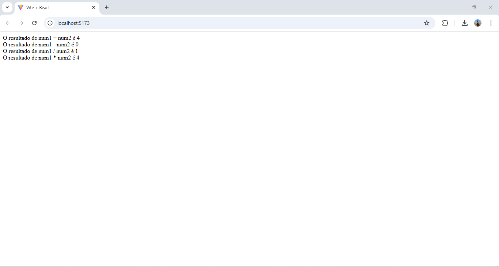

# 📘 Projeto React - Aula 01

Este projeto é destinado ao estudo da disciplina Tecnologia para Front-end Avançado, do curso Sistemas para Internet, UNIESP. 

---

## 🎯 Exercício da aula 01
No React crie 4 componentes no seu projeto: **Adicao**, **Subtracao**, **Multiplicacao** e **Divisao**.

Cada componente deve renderizar a seguinte frase dentro de uma tag `<h1>`:

- Para adição:  
  `O resultado de num1 + num2 é igual a resultado`
- Para subtração:  
  `O resultado de num1 - num2 é igual a resultado`
- Para multiplicação:  
  `O resultado de num1 * num2 é igual a resultado`
- Para divisão:  
  `O resultado de num1 / num2 é igual a resultado`

➡️ `num1` e `num2` são **atributos** do componente.  
➡️ Os componentes devem ser importados no **App.js** e receber os valores via **props**.

## 🖼️ Evidência

=======
